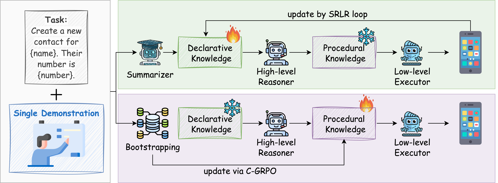

# K²-Agent: Co-Evolving Know-What and Know-How for Hierarchical Mobile Device Control

**K²-Agent** is a hierarchical framework for mobile device control, built upon the cognitive distinction between two fundamental types of human knowledge. The first, **declarative knowledge ("*knowing what*")**, is explicit and can be rapidly articulated and summarized from a few demonstrations into a task plan. The second, **procedural knowledge ("*knowing how*")**, consists of implicit skills acquired through repeated practice to form 'muscle memory' for precise execution. K²-Agent's core design explicitly separates and co-evolves these two capabilities to master complex mobile tasks.

  

  <b>Figure 1:</b> Our motivation, mapping the human cognitive model to mobile device control.

---

## 🚀 Overview

Inspired by this cognitive model, K²-Agent is built on a hierarchical framework where the two knowledge systems follow different update rules and co-evolve.

* **High-Level Planner (Know-What, Training-Free):** A powerful VLM (`Qwen2.5-VL-72B`) that maintains a declarative knowledge base. It uses a **Summarize–Reflect–Locate–Revise (SRLR)** loop, bootstrapped from a single demonstration, to iteratively improve its task-level plans based on execution feedback.
* **Low-Level Executor (Know-How, Learning-Based):** We post-train an efficient `Qwen2.5-VL-7B` model using our **Curriculum-guided Group Relative Policy Optimization (C-GRPO)** algorithm to master a library of precise and generalizable procedural skills.

These two modules co-evolve, creating a powerful closed-loop system where better planning provides better data for skill learning, and improved skills offer more reliable feedback for planning.

  

  <b>Figure 2:</b> The K²-Agent framework, highlighting the SRLR loop for declarative knowledge and C-GRPO for procedural skill acquisition.

---

## 📊 Performance on AndroidWorld

On the **AndroidWorld** benchmark, K²-Agent successfully completes 89 out of 116 tasks, achieving an overall success rate of **76.7%**.

The detailed results for each task are provided below. The execution trajectories for these evaluations can be found in the `androidworld-trajectories.zip`.

### Detailed Task Performance

| Task ID | Task Name                                               | Status     |
| :------ | :------------------------------------------------------ | :--------- |
| 1       | `AudioRecorderRecordAudio`                              | ✅ Success |
| 2       | `AudioRecorderRecordAudioWithFileName`                  | ✅ Success |
| 3       | `BrowserDraw`                                           | ❌ Fail    |
| 4       | `BrowserMaze`                                           | ✅ Success |
| 5       | `BrowserMultiply`                                       | ✅ Success |
| 6       | `CameraTakePhoto`                                       | ✅ Success |
| 7       | `CameraTakeVideo`                                       | ✅ Success |
| 8       | `ClockStopWatchPausedVerify`                            | ✅ Success |
| 9       | `ClockStopWatchRunning`                                 | ✅ Success |
| 10      | `ClockTimerEntry`                                       | ✅ Success |
| 11      | `ContactsAddContact`                                    | ✅ Success |
| 12      | `ContactsNewContactDraft`                               | ✅ Success |
| 13      | `ExpenseAddMultiple`                                    | ✅ Success |
| 14      | `ExpenseAddMultipleFromGallery`                         | ❌ Fail    |
| 15      | `ExpenseAddMultipleFromMarkor`                          | ❌ Fail    |
| 16      | `ExpenseAddSingle`                                      | ✅ Success |
| 17      | `ExpenseDeleteDuplicates`                               | ✅ Success |
| 18      | `ExpenseDeleteDuplicates2`                              | ✅ Success |
| 19      | `ExpenseDeleteMultiple`                                 | ✅ Success |
| 20      | `ExpenseDeleteMultiple2`                                | ✅ Success |
| 21      | `ExpenseDeleteSingle`                                   | ✅ Success |
| 22      | `FilesDeleteFile`                                       | ✅ Success |
| 23      | `FilesMoveFile`                                         | ✅ Success |
| 24      | `MarkorAddNoteHeader`                                   | ❌ Fail    |
| 25      | `MarkorChangeNoteContent`                               | ✅ Success |
| 26      | `MarkorCreateFolder`                                    | ✅ Success |
| 27      | `MarkorCreateNote`                                      | ✅ Success |
| 28      | `MarkorCreateNoteAndSms`                                | ✅ Success |
| 29      | `MarkorCreateNoteFromClipboard`                         | ✅ Success |
| 30      | `MarkorDeleteAllNotes`                                  | ✅ Success |
| 31      | `MarkorDeleteNewestNote`                                | ✅ Success |
| 32      | `MarkorDeleteNote`                                      | ✅ Success |
| 33      | `MarkorEditNote`                                        | ✅ Success |
| 34      | `MarkorMergeNotes`                                      | ❌ Fail    |
| 35      | `MarkorMoveNote`                                        | ✅ Success |
| 36      | `MarkorTranscribeReceipt`                               | ❌ Fail    |
| 37      | `MarkorTranscribeVideo`                                 | ❌ Fail    |
| 38      | `NotesIsTodo`                                           | ✅ Success |
| 39      | `NotesMeetingAttendeeCount`                             | ✅ Success |
| 40      | `NotesRecipeIngredientCount`                            | ✅ Success |
| 41      | `NotesTodoItemCount`                                    | ✅ Success |
| 42      | `OpenAppTaskEval`                                       | ✅ Success |
| 43      | `OsmAndFavorite`                                        | ✅ Success |
| 44      | `OsmAndMarker`                                          | ✅ Success |
| 45      | `OsmAndTrack`                                           | ❌ Fail    |
| 46      | `RecipeAddMultipleRecipes`                              | ❌ Fail    |
| 47      | `RecipeAddMultipleRecipesFromImage`                     | ❌ Fail    |
| 48      | `RecipeAddMultipleRecipesFromMarkor`                    | ❌ Fail    |
| 49      | `RecipeAddMultipleRecipesFromMarkor2`                   | ❌ Fail    |
| 50      | `RecipeAddSingleRecipe`                                 | ✅ Success |
| 51      | `RecipeDeleteDuplicateRecipes`                          | ✅ Success |
| 52      | `RecipeDeleteDuplicateRecipes2`                         | ❌ Fail    |
| 53      | `RecipeDeleteDuplicateRecipes3`                         | ❌ Fail    |
| 54      | `RecipeDeleteMultipleRecipes`                           | ✅ Success |
| 55      | `RecipeDeleteMultipleRecipesWithConstraint`             | ❌ Fail    |
| 56      | `RecipeDeleteMultipleRecipesWithNoise`                  | ✅ Success |
| 57      | `RecipeDeleteSingleRecipe`                              | ✅ Success |
| 58      | `RecipeDeleteSingleWithRecipeWithNoise`                 | ✅ Success |
| 59      | `RetroCreatePlaylist`                                   | ✅ Success |
| 60      | `RetroPlayingQueue`                                     | ❌ Fail    |
| 61      | `RetroPlaylistDuration`                                 | ❌ Fail    |
| 62      | `RetroSavePlaylist`                                     | ❌ Fail    |
| 63      | `SaveCopyOfReceiptTaskEval`                             | ✅ Success |
| 64      | `SimpleCalendarAddOneEvent`                             | ❌ Fail    |
| 65      | `SimpleCalendarAddOneEventInTwoWeeks`                   | ❌ Fail    |
| 66      | `SimpleCalendarAddOneEventRelativeDay`                  | ✅ Success |
| 67      | `SimpleCalendarAddOneEventTomorrow`                     | ✅ Success |
| 68      | `SimpleCalendarAddRepeatingEvent`                       | ✅ Success |
| 69      | `SimpleCalendarAnyEventsOnDate`                         | ✅ Success |
| 70      | `SimpleCalendarDeleteEvents`                            | ✅ Success |
| 71      | `SimpleCalendarDeleteEventsOnRelativeDay`               | ✅ Success |
| 72      | `SimpleCalendarDeleteOneEvent`                          | ✅ Success |
| 73      | `SimpleCalendarEventOnDateAtTime`                       | ✅ Success |
| 74      | `SimpleCalendarEventsInNextWeek`                        | ✅ Success |
| 75      | `SimpleCalendarEventsInTimeRange`                       | ✅ Success |
| 76      | `SimpleCalendarEventsOnDate`                            | ✅ Success |
| 77      | `SimpleCalendarFirstEventAfterStartTime`                | ✅ Success |
| 78      | `SimpleCalendarLocationOfEvent`                         | ❌ Fail    |
| 79      | `SimpleCalendarNextEvent`                               | ✅ Success |
| 80      | `SimpleCalendarNextMeetingWithPerson`                   | ✅ Success |
| 81      | `SimpleDrawProCreateDrawing`                            | ✅ Success |
| 82      | `SimpleSmsReply`                                        | ✅ Success |
| 83      | `SimpleSmsReplyMostRecent`                              | ✅ Success |
| 84      | `SimpleSmsResend`                                       | ✅ Success |
| 85      | `SimpleSmsSend`                                         | ✅ Success |
| 86      | `SimpleSmsSendClipboardContent`                         | ✅ Success |
| 87      | `SimpleSmsSendReceivedAddress`                          | ✅ Success |
| 88      | `SportsTrackerActivitiesCountForWeek`                   | ✅ Success |
| 89      | `SportsTrackerActivitiesOnDate`                         | ❌ Fail    |
| 90      | `SportsTrackerActivityDuration`                         | ✅ Success |
| 91      | `SportsTrackerLongestDistanceActivity`                  | ✅ Success |
| 92      | `SportsTrackerTotalDistanceForCategoryOverInterval`     | ✅ Success |
| 93      | `SportsTrackerTotalDurationForCategoryThisWeek`         | ❌ Fail    |
| 94      | `SystemBluetoothTurnOff`                                | ✅ Success |
| 95      | `SystemBluetoothTurnOffVerify`                          | ✅ Success |
| 96      | `SystemBluetoothTurnOn`                                 | ✅ Success |
| 97      | `SystemBluetoothTurnOnVerify`                           | ✅ Success |
| 98      | `SystemBrightnessMax`                                   | ✅ Success |
| 99      | `SystemBrightnessMaxVerify`                             | ✅ Success |
| 100     | `SystemBrightnessMin`                                   | ✅ Success |
| 101     | `SystemBrightnessMinVerify`                             | ✅ Success |
| 102     | `SystemCopyToClipboard`                                 | ✅ Success |
| 103     | `SystemWifiTurnOff`                                     | ✅ Success |
| 104     | `SystemWifiTurnOffVerify`                               | ✅ Success |
| 105     | `SystemWifiTurnOn`                                      | ✅ Success |
| 106     | `SystemWifiTurnOnVerify`                                | ✅ Success |
| 107     | `TasksCompletedTasksForDate`                            | ❌ Fail    |
| 108     | `TasksDueNextWeek`                                      | ❌ Fail    |
| 109     | `TasksDueOnDate`                                        | ✅ Success |
| 110     | `TasksHighPriorityTasks`                                | ✅ Success |
| 111     | `TasksHighPriorityTasksDueOnDate`                       | ✅ Success |
| 112     | `TasksIncompleteTasksOnDate`                            | ✅ Success |
| 113     | `TurnOffWifiAndTurnOnBluetooth`                         | ✅ Success |
| 114     | `TurnOnWifiAndOpenApp`                                  | ✅ Success |
| 115     | `VlcCreatePlaylist`                                     | ❌ Fail    |
| 116     | `VlcCreateTwoPlaylists`                                 | ❌ Fail    |

---

##  Future Plans

We are committed to fostering open and reproducible research. Our team is currently in the process of cleaning and organizing the codebase and experimental data. Once this process is complete and we receive the necessary internal approvals, we will release our work to the community.

We appreciate your interest and patience, and we look forward to sharing our full work soon.